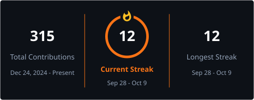
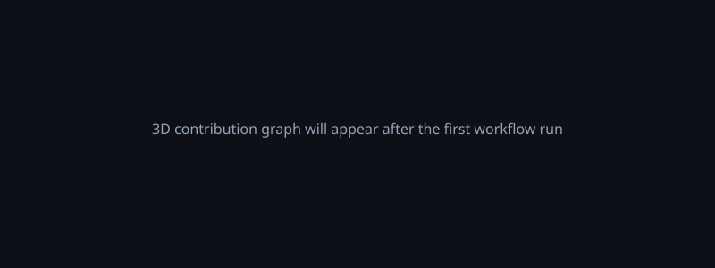

<!--
  Fahad Musa: GitHub Profile README
  Theme: Dark tech with a warm amber/orange accent: #f97316 / #fbbf24 on #0d1117
  Auto-generated assets: profile-3d-contrib/ (3D graph), github-metrics.svg (analytics), output branch (snake) via GitHub Actions
-->

  

  

  

  <em>Building production-style web apps with the MERN stack.</em>

  

  
  
  

  

---

## About Me

Full stack developer from Pakistan, mainly working in the **MERN stack** (MongoDB, Express, React, Node.js), with PHP/MySQL and Laravel in the mix when a project calls for it.

I like building things that actually get finished and work end to end, not half-done demos. Most of what's below are real projects, not tutorial clones.

- Built **CareFlow HMS**, a multi-tenant hospital management SaaS
- Built **DineFlow**, a multi-restaurant POS SaaS
- Focused on clean, responsive interfaces that are actually usable, not just working
- Comfortable across the stack: REST APIs, database design, and the frontend that sits on top of them

---

## Tech Stack

  

  

---

## Featured Projects

  
  

**CareFlow HMS**: a multi-tenant hospital management system. Handles patients, appointments, wards, lab, pharmacy and billing, with each hospital's data fully isolated from the others.

**DineFlow POS**: a multi-restaurant point-of-sale system. Covers orders, a live kitchen display, inventory with recipe-based stock deduction, staff roles and permissions, and reporting.

---

## GitHub Analytics

  

Auto-generated daily by <code>.github/workflows/metrics.yml</code>

  

Auto-generated daily by <code>.github/workflows/streak-stats.yml</code>

---

## 3D Contribution Graph

  

Auto-generated nightly by <code>.github/workflows/3d-contrib.yml</code>

---

## Contribution Snake

  

Auto-generated on push by <code>.github/workflows/snake.yml</code>

---

## What I'm Working On

- Improving **CareFlow HMS**: adding reporting depth and refining the billing/pharmacy modules
- Improving **DineFlow**: kitchen display and inventory workflows
- Building out **Vibely**, a MERN social media app, currently in active development
- Getting better at backend architecture and database design

---

## Other Projects

- **Booksy**: an online bookstore built with PHP and MySQL, with a shopping cart, checkout, admin dashboard and multi-category browsing
- **Premium Shine Detailing**: a website for a mobile car detailing business: services, pricing, a gallery, reviews, and online booking
- **Dental Clinic Website**: a clinic website built to present services clearly and make it easy for patients to get in touch

---

  

  

